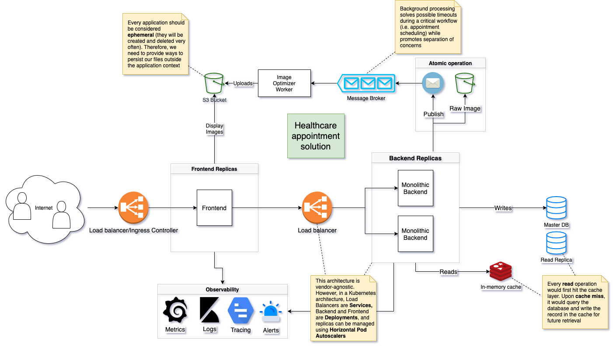
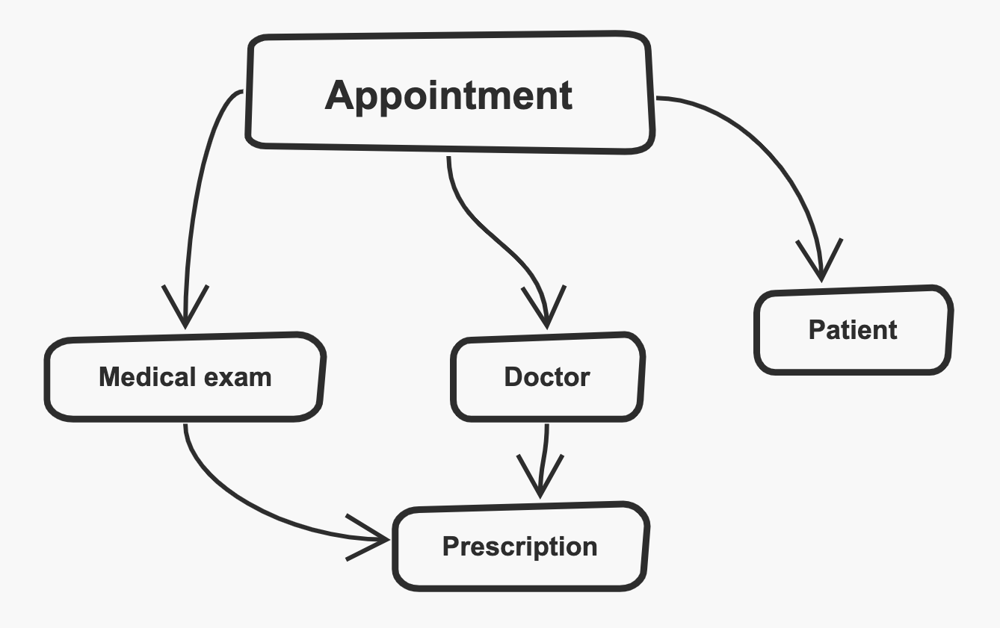
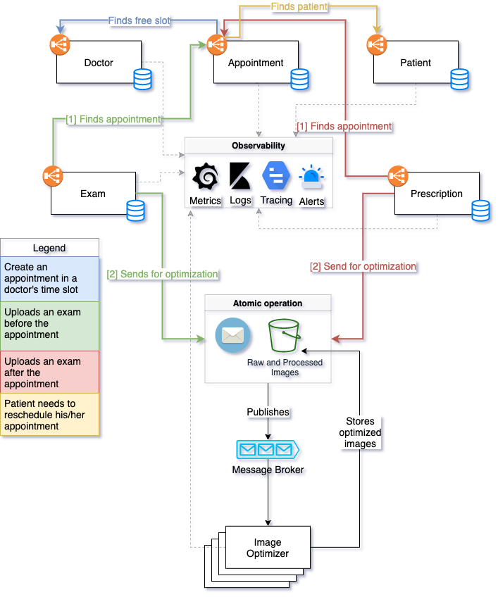

# Sami Architecture test

## Table of Contents
* [Overview](#overview)
* [Generic monolithic solution](#1-generic-monolithic-solution)
    * [Fulfilling the requirements](#fulfilling-the-requirements)
* [Microservices approach](#2-microservices-approach)
    * [Domain Driven Design](#domain-driven-design)
        * [Context Map](#context-map)
        * [Ubiquitou Language](#ubiquitous-language)
    * [Architecture](#architecture)
    * [Product Vision](#product-vision)
    * [A Thing to remember...](#a-thing-to-remember)

## Overview
This document shows a possible tech architecture for a generic domain from a monolithic perspective, and it evolves to a microservice architecture using the concept of [Domain Driven Design](https://en.wikipedia.org/wiki/Domain-driven_design). 

>Even though the test doesn't require a specific domain, a microservice architecture would only make sense inside a specific context, where it mostly benefits from scalability and agility for such domain. I've chosen the **Healthcare** domain for the sake of identity with the company.

The test has 3 hard requirements that must be fulfilled by the architect:

1. Big volume of data, therefore it must be performant on read operations
1. Must handle file upload with file optimization
1. Fewer in number of requests (monolithic approach)

Solution for each requirement will be properly described here.

## #1 Generic monolithic solution

### Fulfilling the requirements
1. To be performant on read operations, I've added a Cache layer in the backend (the one with the Redis logo). 
Since data is in memory, it's much faster to retrieve over querying the database. However, since not every record will be available in the cache, the application will query the database if it doesn't find anything in the cache component, then it will include the record in the cache memory, making it available for future requests. This should significantly reduce queries in database therefore speeding up requests
1. File upload is an issue to be taken apart. Firstly, since a new version of the application will be deployed very often and the old one will get deleted by the deployment pipeline, we must not store files inside the application container, we should think applications as ephemeral entities. A very common way to solve this problem nowadays is to provide a S3-compliant bucket for applications to store the files there. However, since image optimization may have a big cost in terms of time, we can delegate this job to async workers so we prevent having any timeout issue during a critical workflow of our application. (P.S.: with this approach we can scale up workers separately from the backend)
1. Last but not least, in order to minimize the number of requests, I concentrated most of the load in two components: backend and frontend (to scale up development agility, at least). In a monolithic approach, most of data travels inside the memory rather than the network (HTTP calls), making it faster and with fewer number of requests. In a microservice architecture, we would have loads of requests between components in order to make a feature happen.

## #2 Microservices approach
Although I find the solution above is sufficient to solve the problem, we can go further and see how such solution would evolve in a microservices architecture.

### Domain Driven Design
It's crucial to understand the context the application belongs to before we go deeper in technical details. First, we're going to model our domain at business level and figure out what are the core concepts of our application (context map). Then, we will ensure everyone involved in the ecosystem has the same understanding about the product they working on (ubiquitous language).

> Let's design a **Healthcare appointment** solution where we can schedule a doctor's appointment and upload previously done exams so it can be easily retrieved by the doctor whenever he/she needs. Additionally, doctors may write prescriptions for their patients, after the appointment, which will be uploaded and stored for further retrieval as well.

#### Context Map
We can model our [Bounded Context](https://martinfowler.com/bliki/BoundedContext.html) considering the Appointment as a [Aggregate Root](https://martinfowler.com/bliki/DDD_Aggregate.html): 

#### Ubiquitous Language
* **Appointment:** an arrangement to meet a **Doctor** at a particular time and place 
* **Doctor:** a qualified practitioner of medicine, signed up in the system, willing to offer treatment for a **Patient**
* **Patient:** a person receiving medical treatment
* **Medical exam:** a medical test of a specified kind
* **Prescription:** an instruction written by a **Doctor** that authorizes a **Patient** to be provided a medicine or treatment.

### Architecture

Each microservice would implement its RESTful endpoints where one can:
* Onboard a new doctor (`Doctor`)
* Sign up a new patient (`Patient`)
* Create appointments (`Appointment`, `Doctor`, `Patient`)
* Upload exams (`Exam`)
* Upload prescription (`Prescription`)

Also, each microservice has its own database sharing only what's necessary for each interaction to occur. `Exam`, for example, would store `patient_id` and `appointment_id` along with its [Value Objects](https://martinfowler.com/bliki/ValueObject.html) while `Prescription` database would store `doctor_id`, `patient_id` and `appointment_id`.

### Product vision
Why would we go microservices approach after all? Talking about Agile, breaking our monolith down into microservices and separating into several squads would let us optimize delivery value in several ways. For example, let's say we separate into 4 squads and assign them each component:
* Doctor squad works on `Doctor` component
* Appointment squad works on `Appointment` component
* Patient squad works on `Patient` component
* Exam and Prescription squad works on `Exam`, `Prescription` and `ImageOptimizer` component

Below are suggestions for backlogs on each squad:
* **Doctor squad**: improve onboarding for new doctors, doctors' working hours, find closest doctor, etc.
* **Patient squad**: UX research on frontend, document uploader, notification system, etc.
* **Appointment squad**: find best suitable time slot, recurrent scheduling, etc.
* **Exam and Prescription squad**: OCR Image, ML diagnosis, drug delivery integration, etc.

### A Thing to remember...
> Keep in mind that microservices architecture is only necessary in a large, complex environment. Most regular systems would be better off just using simple monoliths following SOLID principles and reap benefits from frequent small deployments.

*Inspirational cartoon: https://pbs.twimg.com/media/EQLSSZPXkAE4CPw.jpg*
