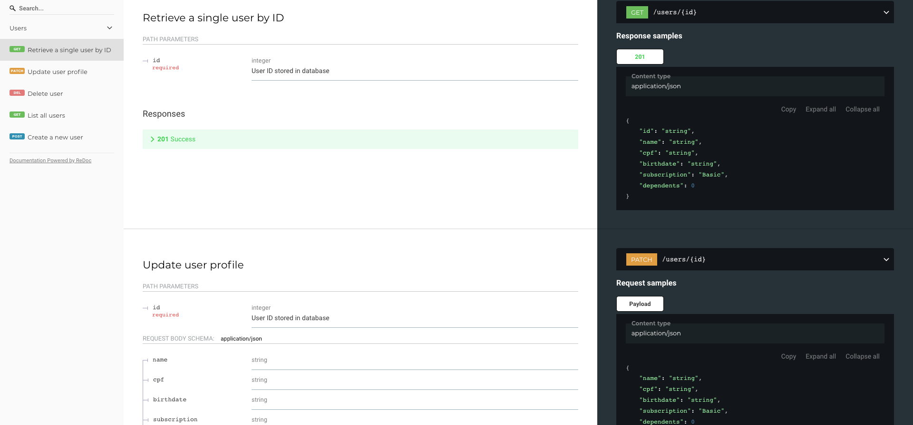

This backend implements a [RESTful](https://restfulapi.net/) CRUD interface for users and complies with Eric Evan's [DDD](https://en.wikipedia.org/wiki/Domain-driven_design) and Uncle Bob's [Clean Architecture](https://blog.cleancoder.com/uncle-bob/2012/08/13/the-clean-architecture.html) which is briefly explained here in the document. 

It also exposes a `/docs/` endpoint for further reference and `/coverage/` for test coverage.

## Installation

```
docker-compose up -d
cp .env.example .env
npm start
```
You should get
```
restify listening at http://[::]:8080
connected to MongoDB database!
```
Access http://localhost:8080/docs/ and http://localhost:8080/coverage/

## Testing

```
npm test
```
It uses an in-memory DB to run tests so you don't need to have mongodb up and running

## Clean Architecture


### Folder structure
```


└ application                   → Application services layer
    └ use_cases                 → Application business rules 
└ domain                        → Enterprise core business layer such as domain model objects (Aggregates, Entities, Value Objects) and repository interfaces
└ infrastructure                → Frameworks, drivers and tools such as Database, the Web Framework, mailing/logging/glue code etc.
    └ config                    → Application configuration files, modules and services
        └ container.js          → Module that manage service implementations by environment
        └ bootstrap.js          → Application's Composition Root
    └ database                  → Database ORMs middleware
        └ schemas               → Mongoose schemas
    └ repositories              → Implementation of domain repository interfaces
    └ webserver                 → Restify Web server configuration (server, routes, plugins, etc.)
        └ server.js             → Restify server definition
└ ports/http                    → Adapters and formatters for use cases and entities to external agency such as Database or the Web
    └ UserController.js         → Restify route handlers
    └ routes.js                 → Restify route definitions
    └ errors.js                 → Standard errors for the whole application
 └ index.js                     → Main application entry point
 ```

 ### The Dependency Rule

>The overriding rule that makes this architecture work is The Dependency Rule. This rule says that source code dependencies can only point inwards. Nothing in an inner circle can know anything at all about something in an outer circle. In particular, the name of something declared in an outer circle must not be mentioned by the code in the an inner circle. That includes, functions, classes. variables, or any other named software entity.

Extracted from https://blog.cleancoder.com/uncle-bob/2012/08/13/the-clean-architecture.html#the-dependency-rule

## Troubleshooting

### Log `connected to MongoDB database!` doesn't appear
The backend uses its own database (`users`) to run its business logic, so you need to ensure this database is created with proper user credentials. The script `mongo-init.js` is run when `docker-compose up` runs for the first time. 

Check in `docker-compose logs mongo` to see if something unusual is happening

### I'm getting `EADDRINUSE` upon application start
You need port `8080` to be free in order to boot up the application. Check if it's already in use and shut the application down before you `npm start` again