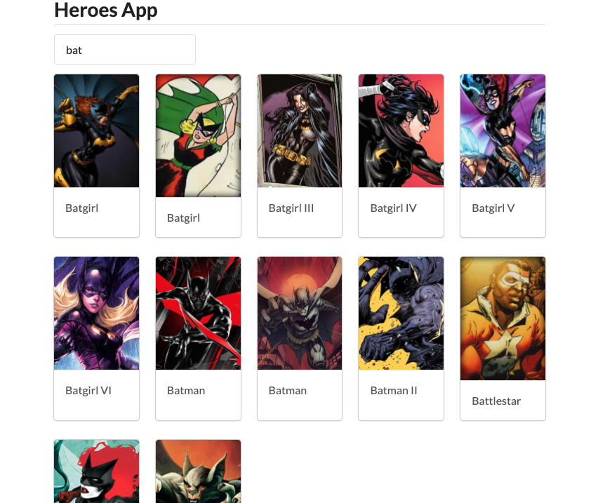

**Heroes App** is a frontend application written in React which consumes [Superhero API](https://superheroapi.com/) and uses [Semantic UI React](https://react.semantic-ui.com/) as its design system for the sole purpose of speeding development up. 

It provides the following features:
* Search for heroes
* List heroes
* View hero's profile

## Libs
* [React 16](https://reactjs.org/)
* [Axios](https://github.com/axios/axios)
* [Redux Toolkit](https://redux-toolkit.js.org/)
* [Semantic UI React](https://react.semantic-ui.com/)
* [Lodash FP](https://github.com/lodash/lodash/wiki/FP-Guide) (Functional Programming version)
* [Jest](https://jestjs.io/en/)
* [Enzyme](https://enzymejs.github.io/enzyme/)

## Installation
* Rename `.env.example` to `.env`
* Get your API Token in [Superhero API](https://superheroapi.com/)
* Fill `REACT_APP_HERO_TOKEN` in `.env` file
* Run `yarn install`

## Usage
```
yarn start
```